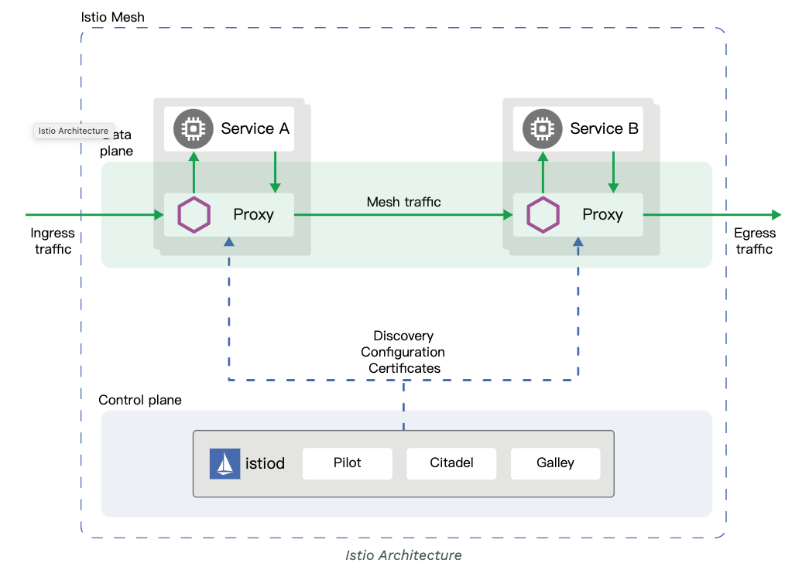

# proxy-istio-demo


该项目主要是介绍了istio 注入sidecar的主要流程,  从Sidecar代理(envoy) 到应用程序的流量 的基本实现原理。

以及一些envoy 的一些配置的示例 yaml 见envoy目录

## 背景

在学习istio的过程中, 在容器的启动流程和注入流程感觉很疑惑 也很复杂。
这个项目主要是为了帮助我们更好的学习istio 帮助我们怎样去理解istio 及istio的工作流程。


在开始之前 

* kubernetes 为 1.16+的集群

## 注入过程一共分为三个过程 分别是

1. demo 

项目路径: ./demo

示例项目 主要是一个http-server 监听8080 端口 

2. sidecar-init 
   
项目路径: ./sidecar-init

初始化容器( init-container) 主要是相当于 istio 注入过程中的istio-init, istio-init 容器的主要功能是修改iptables的规则,
   使流量本来进入demo的流量 改变到 envoy中。

3. proxy  
   
项目路径: ./proxy

proxy 相当于istio 的sidecar 容器 里面主要包含 pilot-agent和envoy，proxy 主要简单实现了一个代理的作用

   
```go
	r.Header.Set("proxy", "xx1")
	time.Sleep(6 * time.Second)
```

在代理的过程中 主要干了这两件事

* 在头部 set了`"proxy": "xx1"` 并 休眠6秒
* 将8888 转到8080 上

## 开始

### 注入之前

首先我们先部署一个demo项目 

```bash
$ kubectl apply -f demo/go/deploy/deployment.yaml
```
 
等待pod `Running` 之后 我们使用curl 命令 请求当前demo服务


```bash

$ curl localhost:8080/?a=b  -vv -w "\n timeout ---> %{time_total} \n"

*   Trying ::1...
* TCP_NODELAY set
* Connected to localhost (::1) port 8888 (#0)
> GET /?a=b HTTP/1.1
> Host: localhost:8888
> User-Agent: curl/7.64.1
> Accept: */*
>
< HTTP/1.1 200 OK
< Content-Length: 11
< Content-Type: text/plain; charset=utf-8
< Date: Thu, 25 Feb 2021 01:49:42 GMT
< hello world: demo
< response proxy header: xx2
<
* Connection #0 to host localhost left intact
{"up":true}
 timeout ---> 0.003932
* Closing connection 0
```

通过响应我们可以看出来 第一头部不包含 key 为proxy的头 第二响应时间小于1秒， 现在我们开始注入sidecar 试试

### 注入之后

```bash
$ kubectl apply -f deploy/deployment.yaml
```

此时可以看到ready status 为2/2， 现在我使用上面相同的curl命令在来请求一次 我们来看看效果如何:

```bash

$ curl localhost:8080  -vv -w "\n timeout ---> %{time_total} \n"

*   Trying ::1...
* TCP_NODELAY set
* Connected to localhost (::1) port 8888 (#0)
> GET / HTTP/1.1
> Host: localhost:8888
> User-Agent: curl/7.64.1
> Accept: */*
>
< HTTP/1.1 200 OK
< Content-Type: application/json
< Date: Thu, 25 Feb 2021 06:04:38 GMT
< demo ->: java
< response proxy header: xx2
< Content-Length: 11
<
* Connection #0 to host localhost left intact
{"up":true}
 timeout ---> 6.007932
* Closing connection 0
```

这个时候我们可以看到出现了 一个为proxy的响应头 和响应时间为6.007932 则证明我的代理设置成功了，以下是istio 注入的设计图


## 在istio 从应用程序容器到Sidecar代理的流量



接下来我们进入istio sidecar容器 
查找NAT 表可以看到一种有以下链

```bash

$ iptables -t nat -S
-P PREROUTING ACCEPT
-P INPUT ACCEPT
-P OUTPUT ACCEPT
-P POSTROUTING ACCEPT
-N ISTIO_INBOUND
-N ISTIO_IN_REDIRECT
-N ISTIO_OUTPUT
-N ISTIO_REDIRECT
-A PREROUTING -p tcp -j ISTIO_INBOUND
-A OUTPUT -p tcp -j ISTIO_OUTPUT
-A ISTIO_INBOUND -p tcp -m tcp --dport 8080 -j ISTIO_IN_REDIRECT
-A ISTIO_IN_REDIRECT -p tcp -j REDIRECT --to-ports 15001
-A ISTIO_OUTPUT ! -d 127.0.0.1/32 -o lo -j ISTIO_REDIRECT
-A ISTIO_OUTPUT -m owner --uid-owner 1337 -j RETURN
-A ISTIO_OUTPUT -m owner --gid-owner 1337 -j RETURN
-A ISTIO_OUTPUT -d 127.0.0.1/32 -j RETURN
-A ISTIO_OUTPUT -j ISTIO_REDIRECT
-A ISTIO_REDIRECT -p tcp -j REDIRECT --to-ports 15001
```

上面的输出清楚地表明，到端口8080（我们的demo应用程序正在侦听的端口）的所有传入流量现在都REDIRECTED到端口15001，这是istio-proxyEnvoy代理正在侦听的端口。
对于传出流量也是如此。

