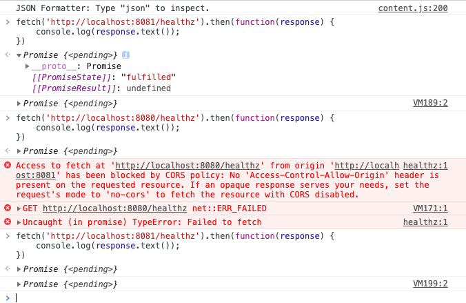

# 跨域请求

在浏览器console 中请求

从中遇到的问题及解决方案


Error: terminal filter named envoy.filters.http.router of type envoy.filters.http.router must be the last filter in a http filter chain.

```bash

# envoy.filters.http.router
# 这个必须在最后一个

http_filters:
  - name: envoy.filters.http.cors
  - name: envoy.filters.http.router
```

配置无效 Missing CORS header despite allowing in config 不允许`cors`

```bash
https://github.com/envoyproxy/envoy/issues/11776
```

```bash
fetch('http://localhost:8081/healthz').then(function(response) {
    console.log(response.text());
})
```

