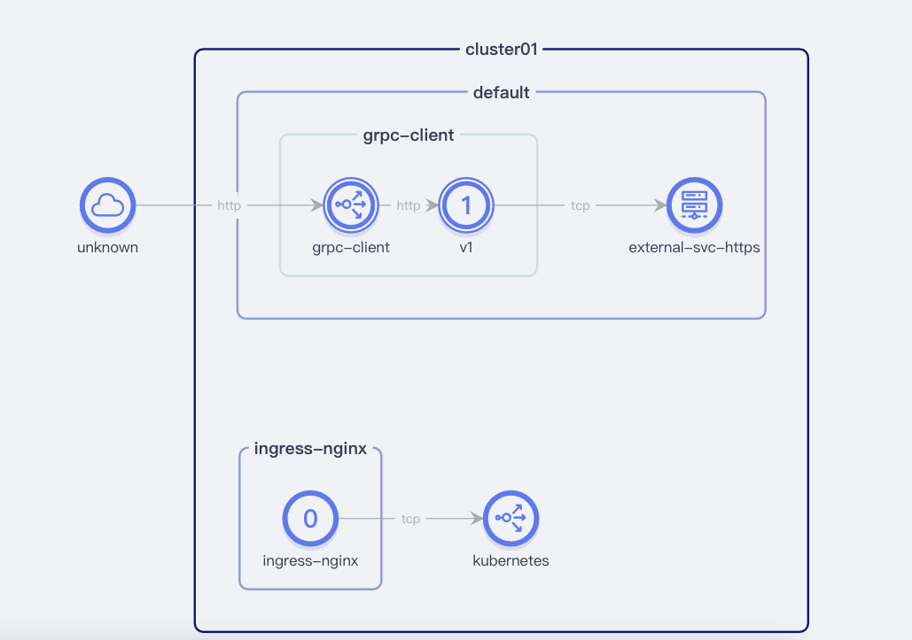

# serviceentry


ServiceEntry允许将其他条目添加到 Istio 的内部服务注册表中，
以便网格中自动发现的服务可以访问/路由到这些手动指定的服务。服务条目描述了服务的属性（DNS 名称、VIP、端口、协议、端点）。
这些服 此外，还可以使用该workloadSelector字段动态选择服务条目的端点。
这些端点可以是使用声明的 VM 工作负载WorkloadEntry对象或 Kubernetes pod。
在单个服务下同时选择 pod 和 VM 的能力允许将服务从 VM 迁移到 Kubernetes，而无需更改与服务关联的现有 DNS 名称。

以下示例声明了一些由内部应用程序通过 HTTPS 访问的外部 API。
Sidecar 检查 ClientHello 消息中的 SNI 值以路由到适当的外部服务。

```yaml
apiVersion: networking.istio.io/v1alpha3
kind: ServiceEntry
metadata:
  name: external-svc-https
spec:
  hosts:
  - www.baidu.com
  location: MESH_EXTERNAL
  ports:
  - number: 443
    name: https
    protocol: TLS
  resolution: DNS
```

如果流量通过nginx代理发送出去流量不直接请求


这个时候跟以上示例 有点区别需要指定当前host的address地址和变更host地址

```bash
apiVersion: networking.istio.io/v1alpha3
kind: ServiceEntry
metadata:
  name: external-svc-https
spec:
  addresses:
  - 10.10.11.110
  hosts:
    - www.baidu.com
  location: MESH_EXTERNAL
  ports:
    - number: 443
      name: https
      protocol: TLS
  resolution: DNS
  

### deploy 需要添加 hostAliases 
  template:
    metadata:
      creationTimestamp: null
      labels:
        app: grpc-client
        version: v1
    spec:
      hostAliases:
      # 与se中的addresses要相同
        - ip: 10.10.13.87
          hostnames:
            - www.baidu.com  
```


效果如下:


istio-proxy 日志


关掉代理nginx访问不通的情况


```bash
➜  ~ curl 10.10.13.118:32639/remote -d '{"url":"https://www.baidu.com"}'  -v
*   Trying 10.10.13.118:32639...
* Connected to 10.10.13.118 (10.10.13.118) port 32639 (#0)
> POST /remote HTTP/1.1
> Host: 10.10.13.118:32639
> User-Agent: curl/7.80.0
> Accept: */*
> Content-Length: 31
> Content-Type: application/x-www-form-urlencoded
>
* Mark bundle as not supporting multiuse
< HTTP/1.1 410 Gone
< date: Tue, 22 Mar 2022 08:22:02 GMT
< content-length: 0
< x-envoy-upstream-service-time: 3
< server: istio-envoy
< x-envoy-decorator-operation: grpc-client.default.svc.cluster.local:8080/*
<
* Connection #0 to host 10.10.13.118 left intact
```

流量试图展示如下:


开启代理

```bash
➜  ~ curl 10.10.13.118:32639/remote -d '{"url":"https://www.baidu.com"}'  -v
*   Trying 10.10.13.118:32639...
* Connected to 10.10.13.118 (10.10.13.118) port 32639 (#0)
> POST /remote HTTP/1.1
> Host: 10.10.13.118:32639
> User-Agent: curl/7.80.0
> Accept: */*
> Content-Length: 31
> Content-Type: application/x-www-form-urlencoded
>
* Mark bundle as not supporting multiuse
< HTTP/1.1 200 OK
< date: Tue, 22 Mar 2022 08:23:02 GMT
< content-length: 0
< x-envoy-upstream-service-time: 53
< server: istio-envoy
< x-envoy-decorator-operation: grpc-client.default.svc.cluster.local:8080/*
<
* Connection #0 to host 10.10.13.118 left intact
```

